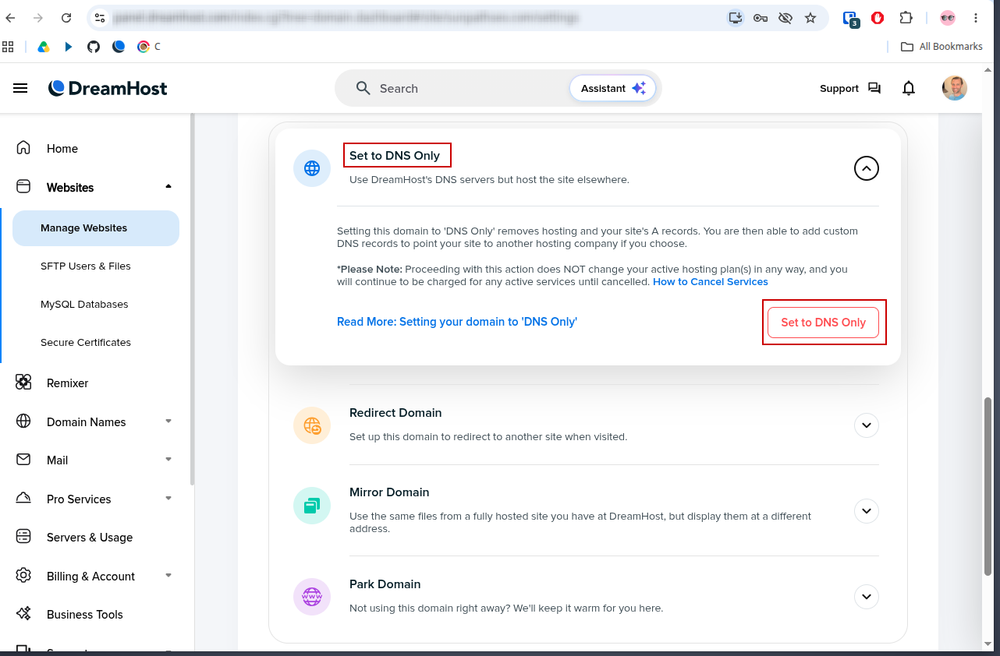
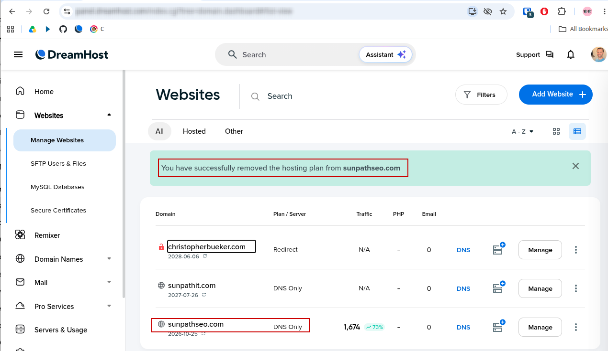
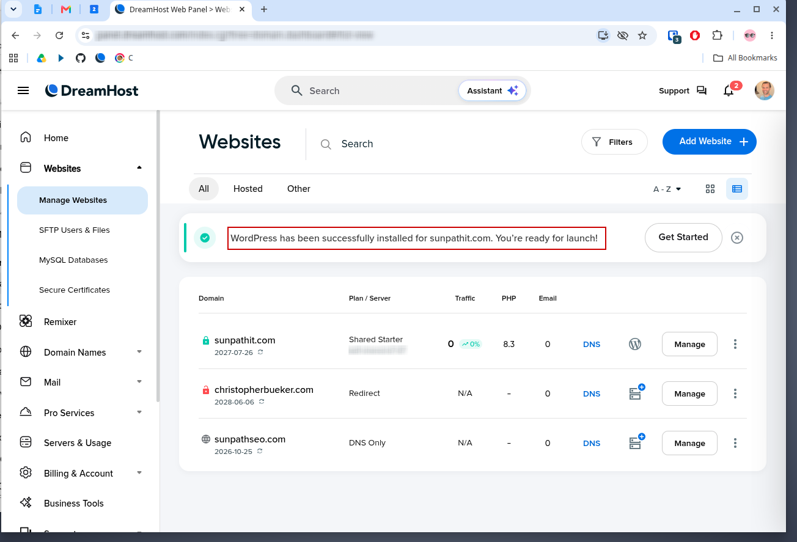
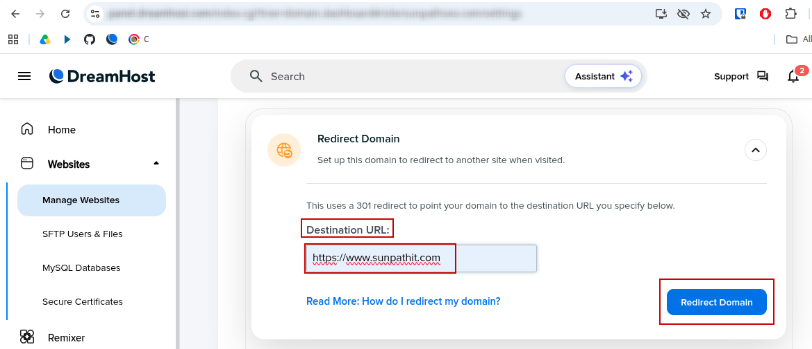
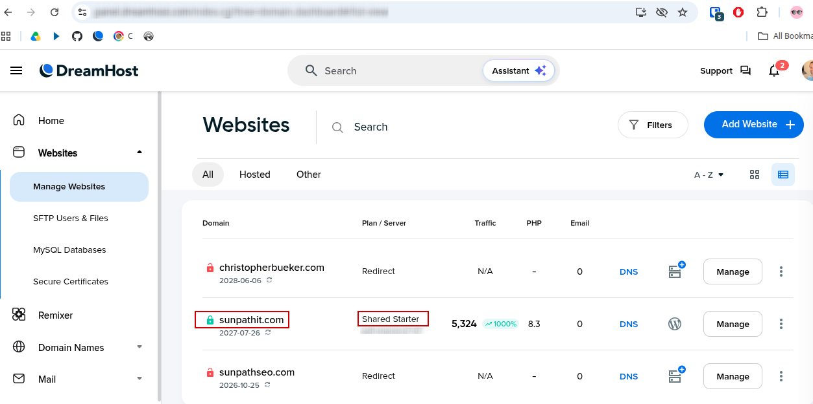
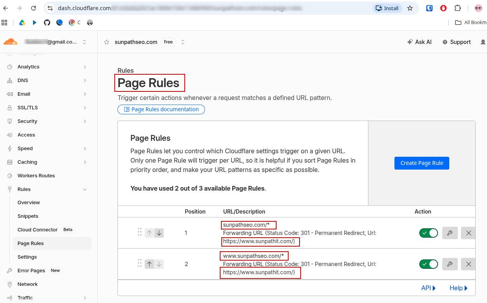
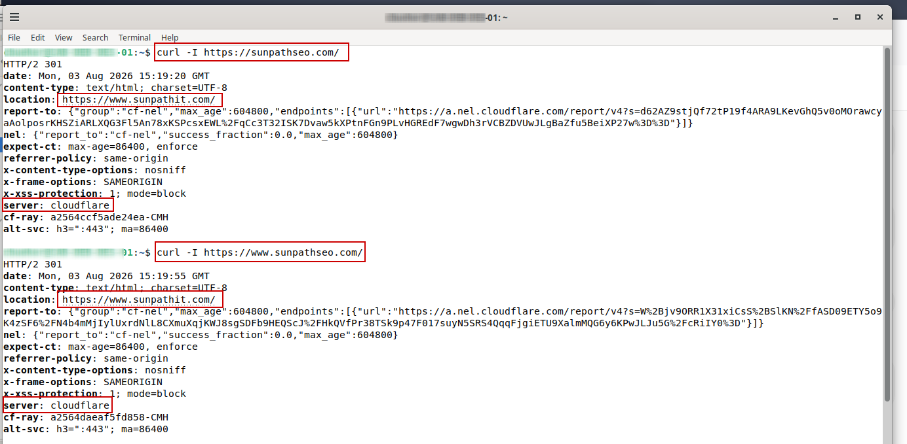

**SunPath IT Site Migration**

Documented website, hosting, DNS, Cloudflare, WordPress, and HTTP 301 redirect migration from SunPath SEO to SunPath IT.

**Project Overview**

SunPath IT started as SunPath SEO, where I focused on technical SEO, WordPress, DNS, Cloudflare, website performance, search visibility, and technical troubleshooting.

While working with small businesses and small organizations, I started realizing that the problem was often much larger than technical SEO. Many small businesses and organizations also need help with their networks, accounts, systems, security, backups, documentation, and overall technical foundation.

That realization led me to expand my services and change the business name from SunPath SEO, LLC to SunPath IT, LLC. Once the business identity changed, I needed to move the website to `sunpathit.com` while continuing to support people who still used the former `sunpathseo.com` address.

This project documents that real migration. I installed the new WordPress site, removed the former hosting environment, configured permanent redirects through DreamHost and Cloudflare, tested both versions of the old domain, and verified the results from my Debian workstation.

**Project Objectives**

- Establish `sunpathit.com` as the primary website for SunPath IT
- Install a new WordPress environment for the renamed business
- Remove the former SunPath SEO hosting environment
- Continue controlling the `sunpathseo.com` domain
- Avoid purchasing an unnecessary additional hosting plan
- Redirect visitors from the former domain to SunPath IT
- Support both the root and `www` versions of the former domain
- Use HTTP 301 permanent redirects for the transition
- Validate the redirect behavior from my Debian workstation
- Minimize and work the eliminate the effect of the migration on web visitors

**DNS-Only Planning**

- Reviewed DreamHost’s DNS-only option for the former `sunpathseo.com` domain.
- My hosting plan supported one active website, and I did not need to purchase another hosting plan for the transition.
- This gave me a path to keep control of the old domain while preparing it for redirect use.

**Old Hosting Plan Removal**

- Removed the active hosting plan from `sunpathseo.com`.
- I needed the available hosting slot for the new `sunpathit.com` website and chose not to pay for an additional plan.
- DreamHost confirmed that the old hosting plan was removed while the domain remained available for DNS and redirect configuration.

**New WordPress Site Installation**

- Installed WordPress for the new `sunpathit.com` website.
- The new site needed to represent the transition from SunPath SEO to the broader SunPath IT business.
- DreamHost confirmed that WordPress was successfully installed and ready for configuration.

**Redirect Destination Configuration**

- Configured the former SunPath SEO domain to redirect to `https://www.sunpathit.com/`.
- Existing business materials, referrals, and online references still directed people to `sunpathseo.com`.
- The redirect provided a practical way to send those visitors to the active SunPath IT website.

**Final Domain and Hosting Status**

- Reviewed the final DreamHost configuration after completing the hosting and redirect changes.
- I needed to confirm that the new website was actively hosted and that the former domain was no longer using the hosting slot.
- `sunpathit.com` showed active hosting, while `sunpathseo.com` showed redirect status.

**Cloudflare 301 Redirect Rules**

- Configured Cloudflare rules for both `sunpathseo.com/*` and `www.sunpathseo.com/*`.
- Both versions of the former domain needed to send visitors to the same SunPath IT address.
- The enabled rules used HTTP `301` permanent redirects to `https://www.sunpathit.com/`.

**Command-Line Redirect Validation**

- Tested both versions of the former SunPath SEO domain from my Debian workstation using `curl -I`.
- Command-line testing allowed me to verify the HTTP status, redirect destination, and responding service directly.
- Both requests returned `HTTP/2 301`, pointed to `https://www.sunpathit.com/`, and showed Cloudflare as the responding server.

**Business Impact**

This project allowed for a real business migration while preserving a working path for visitors of SunPathSEO.com.

Visitors who went to `sunpathseo.com` were successfully redirected to `https://www.sunpathit.com/`.

This type of migration also allowed me to move the business to its new SunPath IT identity without paying for an unnecessary second hosting plan.

The transition caused about 45 to 60  minutes of downtime. I completed the work on a Sunday afternoon, which helped reduce the likelihood of affecting normal business activity and minimized the overall business impact.

**Skills Demonstrated**

- Website migration planning
- WordPress installation
- DreamHost administration
- DNS and domain management
- Cloudflare page rules
- HTTP 301 redirects
- Canonical-domain planning
- Linux command-line validation
- HTTP header review with `curl`
- Change planning
- Business-continuity awareness
- Technical documentation

**Summary**

This project documents the technical transition from SunPath SEO to SunPath IT.

I established the new WordPress website, removed the previous hosting environment, configured permanent redirects for the former domain, and validated the results from Linux.

The project shows how website administration, hosting, DNS, Cloudflare, HTTP behavior, cost awareness, and business planning work together during a real business transition.

Navigation

[`Back to GitHub Profile`](https://www.github.com/cbueker-it)
